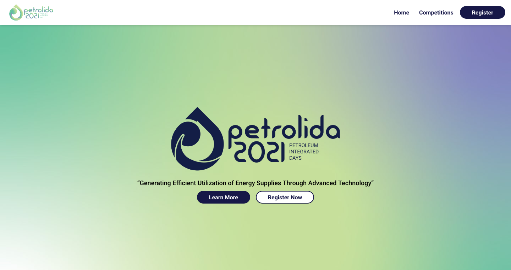

# Petrolida 2021
<!-- ALL-CONTRIBUTORS-BADGE:START - Do not remove or modify this section -->

<!-- ALL-CONTRIBUTORS-BADGE:END -->

This is a website for Petrolida 2021 by SPE ITS SC. Made with Next.js, Tailwindcss, and GSAP.

© [Theodorus Clarence](https://theodorusclarence.com) & [Ishaq Adheltyo](https://www.linkedin.com/in/ishaq-adheltyo-b53832106/)

## Deployment

[Deploy Link](http://petrolida.its.ac.id)

[Preview Link](https://petrolida-2021.vercel.app)

## Project Details

For project details [check out on this site](https://theodorusclarence.com/projects/petrolida-2021).

## Contributors ✨

Thanks goes to these wonderful people ([emoji key](https://allcontributors.org/docs/en/emoji-key)):

<!-- ALL-CONTRIBUTORS-LIST:START - Do not remove or modify this section -->
<!-- prettier-ignore-start -->
<!-- markdownlint-disable -->
<table>
  <tr>
    <td align="center"><a href="https://theodorusclarence.com"> <b>Theodorus Clarence</b></a> <a href="https://github.com/theodorusclarence/petrolida-2021/commits?author=theodorusclarence" title="Code">💻</a> <a href="#design-theodorusclarence" title="Design">🎨</a></td>
    <td align="center"><a href="https://ishaqadhel.com"> <b>ishaqadhel</b></a> <a href="https://github.com/theodorusclarence/petrolida-2021/commits?author=ishaqadhel" title="Code">💻</a> <a href="#design-ishaqadhel" title="Design">🎨</a></td>
  </tr>
</table>

<!-- markdownlint-restore -->
<!-- prettier-ignore-end -->

<!-- ALL-CONTRIBUTORS-LIST:END -->

This project follows the [all-contributors](https://github.com/all-contributors/all-contributors) specification. Contributions of any kind welcome!
